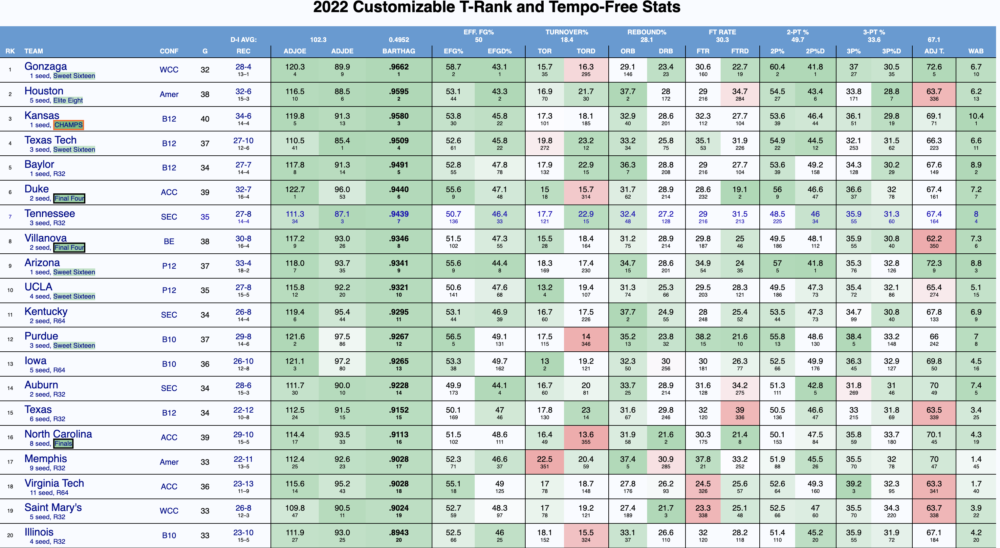
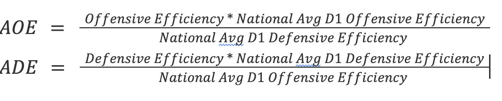

```{r setup, include=FALSE}
knitr::opts_chunk$set(echo = TRUE)
library(tidyverse) 
library(readr)
library(modelr)
library(ggplot2)
library(ggthemes)
library(leaps)

source("https://raw.githubusercontent.com/JA-McLean/STOR455/master/scripts/ShowSubsets.R")
```


```{r, include=F}
# Data setup
CBB = read_csv("cbb.csv")
CBB <- CBB %>% 
  rename(School=TEAM) %>% 
  rename(Conference=CONF) %>% 
  rename(GamesPlayed = G) %>% 
  rename(GamesWon = W) %>% 
  rename(AdjustedOffensiveEfficiency=ADJOE) %>% 
  rename(AdjustedDefensiveEfficiency=ADJDE) %>% 
  rename(PowerRating = BARTHAG) %>% 
  rename(EffectiveFieldGoalPercentageShot=EFG_O) %>% 
  rename(EffectiveFieldGoalPercentageAllowed=EFG_D) %>% 
  rename(TurnoverRate=TOR) %>% 
  rename(StealRate=TORD) %>% 
  rename(OffensiveReboundRate=ORB) %>% 
  rename(OffensiveReboundRateAllowed=DRB) %>% 
  rename(FreeThrowRate=FTR) %>%
  rename(FreeThrowRateAllowed = FTRD) %>% 
  rename(TwoPointShootingPercentage = "2P_O") %>% 
  rename(TwoPointShootingPercentageAllowed='2P_D') %>% 
  rename(ThreePointShootingPercentage='3P_O') %>% 
  rename(ThreePointShootingPercentageAllowed='3P_D') %>% 
  rename(AdjustedTempo=ADJ_T) %>% 
  rename(WinsAboveBubble=WAB) %>% 
  rename(Postseason=POSTSEASON) %>% 
  rename(Seed=SEED) %>% 
  rename(Season=YEAR)

q1 <- filter(CBB, !is.na(Postseason)) %>% 
  mutate(WinningPercentage = GamesWon / GamesPlayed)

q1$Postseason[q1$Postseason == "Champions"] <- 8
q1$Postseason[q1$Postseason == "2ND"] <- 7
q1$Postseason[q1$Postseason == "F4"] <- 6
q1$Postseason[q1$Postseason == "E8"] <- 5
q1$Postseason[q1$Postseason == "S16"] <- 4
q1$Postseason[q1$Postseason == "R32"] <- 3
q1$Postseason[q1$Postseason == "R64"] <- 2
q1$Postseason[q1$Postseason == "R68"] <- 1

q1$Postseason = as.integer(as.numeric(q1$Postseason))
q1$Seed = as.integer(q1$Seed)
```

# INTRODUCTION: 

Being in a college like UNC, it is almost impossible not to love the UNC Basketball team. That being said, when March Madness is finally upon us and it’s time to create our brackets, everybody wants to create the best bracket they can; however, they never really know where to begin. That’s where our dataset comes in. The “College Basketball Dataset” is originally from http://www.barttorvik.com/#, but has been created and cleaned on Kaggle by owner Andrew Sundberg contains data on college basketball from the years 2013 through 2021. 

Our analysis focuses on the central theme of the best predictors in college basketball. Our first question focuses on different conferences in college basketball and on average which of these conferences have improved based off of three metrics: the power rating, the turnover rate, and the winning percentage. This question helps us understand which conference is “best” since there is always an ongoing debate on which conferences should be considered the “power five conferences”. Typically power five is considered as ACC, Big 10, Big12, Pac 12, and SEC. Although the teams within this conference may see higher efficiencies, they may not experience as much growth. However, Determining the conferences that excelled the best in these metrics will help with predictions later on as well as understanding how talent within a conference changes over time. 

Our second question focuses more on whether or not we could predict how far a school will go in the NCAA. It is a question that many would be interested in since everybody wants their March Madness brackets to be the best and our analysis would help them see what would count as the best predictors in the same. The odds of a perfect bracket being 1 in 9.2 quintillion and upsets are almost luck-based when it comes to predictions. However through data analysis and trends it is possible to predict upsets, final four teams, and other categories improving a bracket. The information in this data set allows our group to answer questions based around improvements and tournament predictions. 

# DATA: 
  The data we used was called the “College Basketball Dataset”, which we briefly touched on in the introduction, was retrieved off Kaggle. It contained data from 2013, 2014, 2015, 2016, 2017, 2018, 2019, 2020, and 2021 Division I college basketball seasons. However, it was originally scraped from the following domain, http://www.barttorvik.com/#. The original data was messy to look at, for reference look at the figure below.

```{r echo=FALSE, out.width='100%'}

```

The owner, Andrew Sunberg, a graduate from Iowa State University thought certain variables were missing and important to add to create the “College Basketball Dataset”. During the cleaning process of the data set the variables POSTSEASON, SEED, and YEAR were added which will be explained later. In doing so there were over 2,450 observations based on 355 unique values for division I college basketball teams. The column labels range from School, Games won, Adjusted Offensive Efficiency, etc. By looking at the descriptive figure below, you can see the data is easier to look at and quickly to identify the most important variables.


Although the descriptive figure showed the key variables, our data set consisted of 24 total variables. One of the key variables is “Winning Percentage”. To calculate Winning Percentage, you have to look at the two other variables that go into the calculation. That is Games Played and Games Won. Games Played is the total number of games they competed in throughout the season no matter the result of the game. Whereas Game Won is the total number of games that the team competed in and won. It is important to note that Games Played and Games Won include not only the regular season but Postseason as well. Postseason is the games during the tournament played after the regular season. Two other key variables are “AdjustedOffensiveEfficiency” (AOE) and “AdjustedDefensiveEfficiency” (ADE).  To understand what these variables calculate we need to look at how they are calculated. Offensive Efficiency is calculated by using 100*(Points Scored/Possessions), and Defensive Efficiency is calculated through 100*(Points allowed/ possessions). These are used to calculate AOE and ADE which are calculated as seen below:


```{r echo=FALSE, out.width='100%'}

```


These variables help judge the strength of a team's  offensive and defensive abilities. These are beneficial as it allows teams to be better compared to each other and the national average for these metrics. 
	A key variable that helps us answer our second key question is Postseason. Postseason tells us how far the division I college basketball team went in March Madness or the tournament after the regular season. Originally, the variable was given in confusing outputs that would complicate graphs. The outputs ranged from Champions, E8, 2ND, etc. So in order to easily identify how far a team went in the Postseasons, we changed the following outputs: RD68 = 1 (lost the first game), RD64 = 2, RD32 = 3, S16 = 4, E8 = 5, F4 = 6, 2ND = 7, and Champions = 8 (won the tournament). To better understand Postseason, let us look at the relationship between Postseason and Winning Percenatge.
	
```{r}
WinningPostseason <- filter(CBB, !is.na(Postseason)) %>%

  mutate(WinningPercentage = GamesWon / GamesPlayed)

 

WinningPostseason$Postseason[WinningPostseason$Postseason == "Champions"] <- 8

WinningPostseason$Postseason[WinningPostseason$Postseason == "2ND"] <- 7

WinningPostseason$Postseason[WinningPostseason$Postseason == "F4"] <- 6

WinningPostseason$Postseason[WinningPostseason$Postseason == "E8"] <- 5

WinningPostseason$Postseason[WinningPostseason$Postseason == "S16"] <-4

WinningPostseason$Postseason[WinningPostseason$Postseason == "R32"] <- 3

WinningPostseason$Postseason[WinningPostseason$Postseason == "R64"] <- 2

WinningPostseason$Postseason[WinningPostseason$Postseason == "R68"] <- 1

 

WinningPostseason$Postseason= as.numeric(WinningPostseason$Postseason)

 

DataFigure<-ggplot(WinningPostseason, aes(x=Postseason, y= WinningPercentage)) +

    geom_point() +

  geom_smooth(method=lm, se=FALSE) + ggtitle("Correlation Between Winning Percentage and Postseason")+

   xlab("Postseason") +ylab("Winning Percentage") + theme_economist()

DataFigure


```
	
	
	
	
As seen in the figure, the upward sloping line shows the positive correlation between the two variables. In plainer terms, the team that won the tournament in the Postseason would have a higher Winning percentage since they had to win more games to make it to the end of the tournament. 
Some other key variables are Turnover Rate and Power Rating. Turnover rate is the amount of times a team gives up possession per 100 possession. Power Rating is the chance of the team beating an average division I team. 


# RESULTS:
## Question 1: 
To answer our first question and determine which conference has had the most improvement over the past years, we examined three determinant variables. In our initial questions leading us into our final questions, we found that Winning Percentage, Turnover Rate, and Power Rating were good indicators of the quality of a team. This is why we chose these variables to analyze the improvement of conferences. As a first step, we gathered all of the teams in their respected conference for two different years, 2013 and 2019. It is important to note that we decided to leave out 2020 and 2021 due to COVID implications in the year 2020. A lot of the data for 2020 was incomplete or partially recorded due to seasons being cut short due to the pandemic. This would cause our data to be incomplete or inaccurate, so excluding such years will prove to make our data more precise. Another implication we ran into was the American….

From the two years, 2013 and 2019, we calculated the total average of the three different variables in both years. This allowed us to gauge the differences or improvements. To better understand how substantial these differences were, we then calculated the average percent of increase from 2013 to 2019. Average percent of increase is calculated as follows: new finding - old finding / old finding. By doing so we created three new tables to display the information. We wanted to see what were the largest improvements of conferences, so we listed the top 5 conferences in each table with the largest improvement. 


THREE TABLES 


The first observation we noticed is most of the conferences that were in the top 5 were non power 5 conferences. Non power 5 conferences include the Big 10, the Big 12, ACC, Pac-12, and the SEC. This was alarming to us at first because historically the power 5 conferences are the better teams across most collegiate sports. However, the cause could be quite simple. The power 5 conferences have good numbers in the three variables already with little room to grow. Whereas the smaller conference such as MAC or Mid-American Conference have large areas to approve on as college basketball is becoming more competitive across all conferences. Furthermore, looking at these tables, you may notice turnover rate is ranked by the highest negative number. This is because turnovers are not a positive attribute to a team and will cause negative effects on wins. So by decreasing a team’s turnover rate, the team in turn improves the quality of their team. 

To better illustrate the differences among the top 5 conferences in each variable, we made three different bar graphs to visually show differences. Again, the turnover rate bar graph seems to be upside. However, this is because as previously stated, lowering your turnover rate improves the quality of the team. 

```{r}
CBB_Conference= CBB %>% mutate(WinningPercentage = GamesWon / GamesPlayed)

CBB_Conference2= CBB_Conference %>% group_by(Conference, Season)

CBB_Conference3 = CBB_Conference2 %>% summarise(AverageTOR= mean(TurnoverRate),AveragePR= mean(PowerRating),AverageWP=mean(WinningPercentage)) %>% filter(Season %in% c(2013,2019))

 

 

Percentchange= CBB_Conference3 %>% mutate(pct_change_tor = ((AverageTOR/lag(AverageTOR) - 1) * 100)) %>% mutate(pct_change_pr = ((AveragePR/lag(AveragePR) - 1) * 100)) %>% mutate(pct_change_wp = ((AverageWP/lag(AverageWP) - 1) * 100))

 

 

PercentChangeTOR= Percentchange[order(Percentchange$pct_change_tor),] %>% select(Conference, pct_change_tor)

Top5ChangeTOR= head(PercentChangeTOR,5)

 

PercentChangePR= Percentchange[order(-Percentchange$pct_change_pr),] %>% select(Conference, pct_change_pr)

Top5ChangePR= head(PercentChangePR,5)

 

PercentChangeWP= Percentchange[order(-Percentchange$pct_change_wp),] %>% select(Conference, pct_change_wp)

Top5ChangeWP=head(PercentChangeWP,5)

 

Top5ChangeTOR$Conference=factor(Top5ChangeTOR$Conference,levels= Top5ChangeTOR$Conference[order(Top5ChangeTOR$pct_change_tor, decreasing=FALSE)])

ggplot(Top5ChangeTOR)+ geom_bar(aes(x= Conference,y=pct_change_tor),stat= "identity") + ggtitle("Conferences With The Highest Percent Decrease In TOR ")+

   xlab("Conference") +ylab("Percent Change")+ theme_bw()

 

Top5ChangePR$Conference=factor(Top5ChangePR$Conference,levels= Top5ChangePR$Conference[order(Top5ChangePR$pct_change_pr, decreasing=TRUE)])

ggplot(Top5ChangePR)+ geom_bar(aes(x= Conference,y=pct_change_pr),stat= "identity")+ ggtitle("Conferences With The Highest Percent Increase in PR")+

   xlab("Conference") +ylab("Percent Change")+theme_bw()

 

Top5ChangeWP$Conference=factor(Top5ChangeWP$Conference,levels= Top5ChangeWP$Conference[order(Top5ChangeWP$pct_change_wp, decreasing=TRUE)])

ggplot(Top5ChangeWP)+ geom_bar(aes(x= Conference,y=pct_change_wp),stat= "identity")+

  ggtitle("Conferences With The Highest Percent Increase in WP")+

   xlab("Conference") +ylab("Percent Change")+ theme_bw()
```

MAC is a top 5 team in all three categories or variables. This lead us to believe that the conference that has improved the most over the past years is the MAC or Mid-American Conference. 

## Question 2: 

Our next question attempts to answer as to whether we are able to effectively predict how far a team would be able to go in the Postseason tournament given their stats. We first split the data through random sampling into 80% train sets and 20% test sets. Then we built linear models to predict how far a team goes in the Postseason using a combination of predictors. To determine what were the best predictors, we used Best Subsets Regression, utilizing the regsubsets function within the leaps package. This function helps us find linear models with the least Mallow's Cp. Mallow's Cp is a method to compare the full model to smaller models with the best subsets of predictors, with a lower value indicating a better model as it suggests smaller amounts of unexplained error. 


# CONCLUSION:

In our analysis we wanted to solve two crucial questions about our data involving basketball. Our first inquiry was about which conference has improved the most over the past years. In doing so, we used three determinant variables that we deemed useful in analyzing the quality of a team. Those variables being turnover rate, winning percentage, and power rating. Although skeptical, we were expecting some if not all power 5 conferences to be some of the most improved teams. In our process in finding the percent increase with the respected variables, we found that no power 5 conference was ranked top 5 in any category. Although unusual at first glance, power 5 teams have very good scores in these three variables already. Thus, their room for improvement is very little compared to non power 5 conferences. Yet, with the findings of smaller conferences having large improvements shows that division I college basketball is becoming more competitive across all conferences and not so dominated by a few conferences. To take this analysis even further, one could make a model to predict the trend of improvements for these conferences in the future. This could help shed light on if these historic power 5 conferences could be taken over by different conferences in the future. With just looking at a short fluctuation from 2013 to 2019 but seeing large improvements in these smaller conferences could mean they will continue to improve in the long run.


